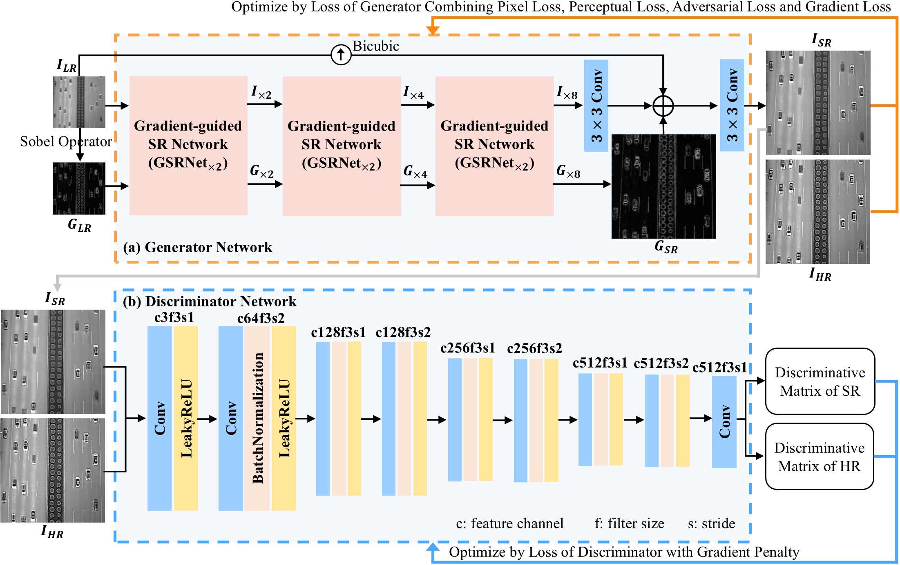
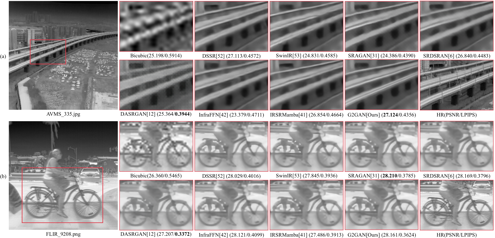
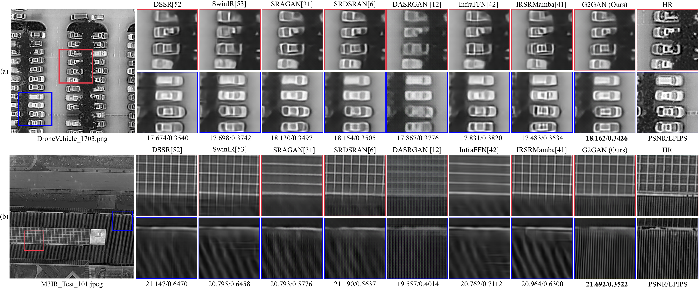
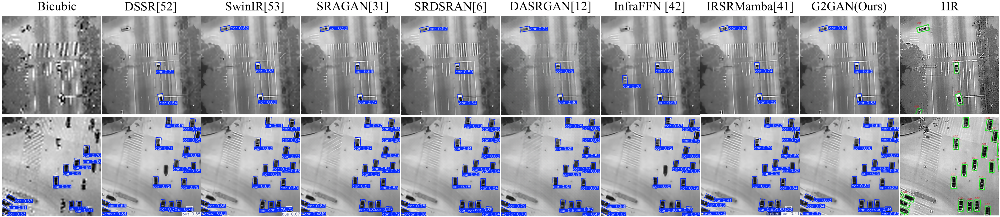

# G2GAN

**G2GAN: A Gradient-Guided Progressive Generative Adversarial Network Method for Infrared Image Super-Resolution**

  - Fanen Meng, Yongfei Xian, Yi Xiao, Laifu Zhang, Zhiguo Jiang, Fengying Xie, Sensen Wu, Zhenhong Du, Haopeng Zhang

  - Submitted to journal, currently under review

  - This is our first submission. We will gradually update the dataset and code.



Fig. 1. Overview of the proposed G2GAN. (a) Generator Network. (b) Discriminator Network.

## Folder Structure

Our folder structure is as follows:

```
├── G2GAN (code)
│   ├── data
│   │   ├── data.py
│   │   ├── dataset.py
│   ├── dataset
│   │   ├── AVMS
│   │   ├── FLIR
│   │   ├── DroneVehicle
│   │   ├── M3IR(Ours)
│   ├── model
│   │   ├── dssr.py      (dssr model)
│   │   ├── swinIR.py    (swinir model)
│   │   ├── sragan.py    (sragan model)
│   │   ├── srdsran.py   (srdsran model)
│   │   ├── dasrgan.py   (dasrgan model)
│   │   ├── infraffn.py  (infraffn model)
│   │   ├── irsrmamba.py (irsrmamba model)
│   │   ├── g2gan.py     (Ours model)
│   ├── utils
│   ├── main_dssr.py
│   ├── main_swinir.py
│   ├── main_sragan.py
│   ├── main_srdsran.py
│   ├── main_dasrgan.py
│   ├── main_infraffn.py
│   ├── main_irsrmamba.py
│   ├── main_g2gan.py
```

## Introduction

- G2GAN (gradient guided progressive generative adversarial network)

  - Contains eight super-resolution models: ['DSSR', 'SwinIR', 'SRAGAN', 'SRDSRAN', 'DASRGAN', 'InfraFFN', 'IRSRMamba', '**G2GAN**']


## Environment Installation

The G2GAN model uses python 3.8, pytorch 1.9, tensorflow-gpu 2.1.0

```bash
pip install -r requirements.txt
```

## Dataset Preparation

We used four datasets to train our model. After secondary processing, we obtained a total of about 16,200 images of 512*512 size.  

- Train
  
  - ["AVMS", "FLIR", "DroneVehicle", "M3IR-1k"]
- Test
  
  - ["AVMS", "FLIR", "DroneVehicle", "M3IR-1k"]
- Link: Our initial M3IR-1k dataset (1,273 paired visible-infrared images, each 1280x1024 pixels) [[Baidu Cloud Disk (code: xxxx)](https://pan.baidu.com/s/1VkxQDSk10JWqMvnS_g5DDA)], and the cropped dataset used for training and testing (16200 infrared images, each 512x512 pixels) [[Baidu Cloud Disk (code: xxxx)](https://pan.baidu.com/s/1c1ZOfQ88m9dz85YiPuXHjw)].

## Train & Evaluate
1. Prepare environment, datasets and code.
2. Run the training/evaluation code. This code is designed for training on a single GPU.

```bash
# g2gan
cd G2GAN
python main_g2gan.py
---------------------------------------------------------------
net.train()                       # train
net.mfeNew_validateByClass()      # test
---------------------------------------------------------------
python main_dssr.py            
python main_swinir.py
python main_sragan.py
python main_srdaran.py            # Train and test of all comparison methods
python main_dasrgan.py
python main_infraffn.py
python main_irsrmamba.py
```

## Results

### 1. Comparison on AVMS and FLIR Datasets



Fig. 6. Qualitative comparison of x8 SR reconstruction results from different methods. (a) AVMS dataset. (b) FLIR dataset. Bold denotes the best metric result.

### 2. Comparison on DroneVehicle and M3IR-1k Datasets



Fig. 7. Qualitative comparison of x8 SR reconstruction results from different methods. (a) DroneVehicle dataset. (b) M3IR dataset. Bold denotes the best metric result.

### 3. Object Detection Evaluation of SR Results



Fig. 8. Detection performance comparison of our G2GAN with other methods on the sample images.

## Contact

If you have any questions about it, please feel free to let me know. (email:[mengfanen@tmslab.cn; 12238036@zju.edu.cn]


